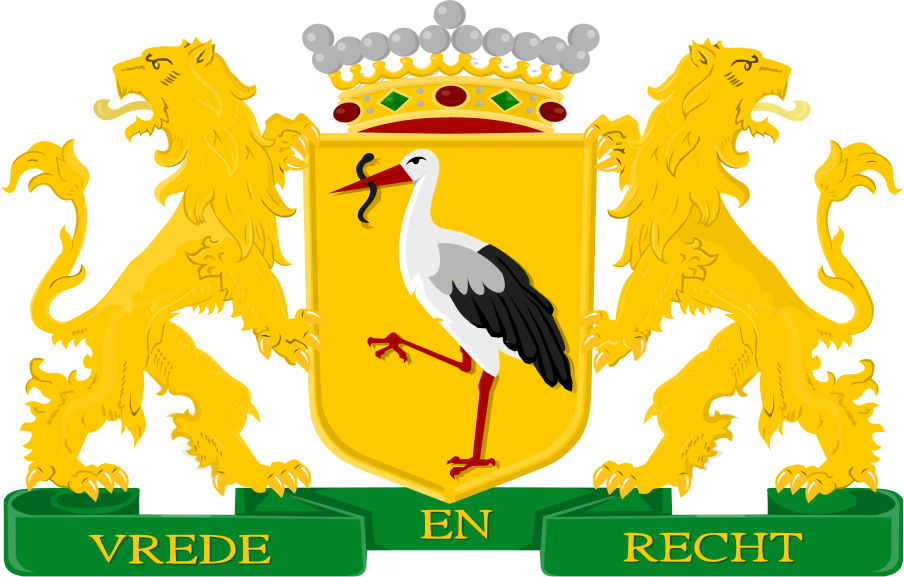
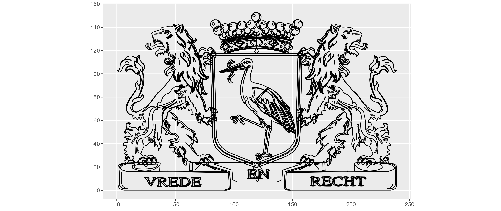
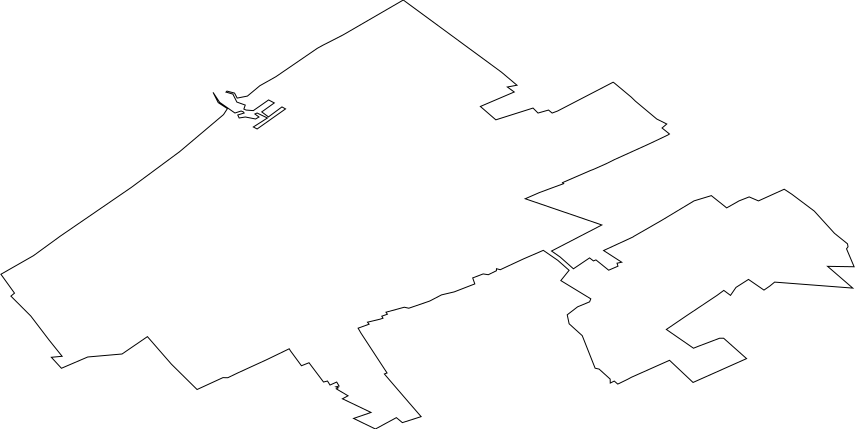
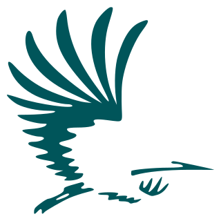
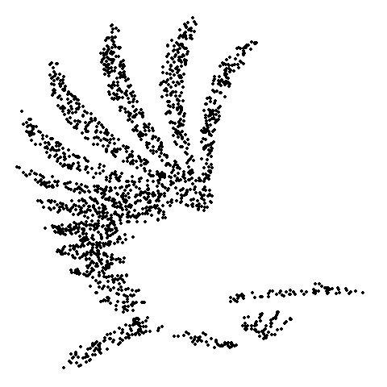
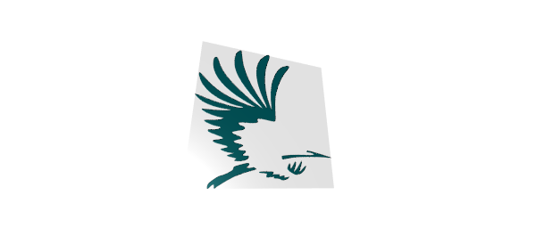
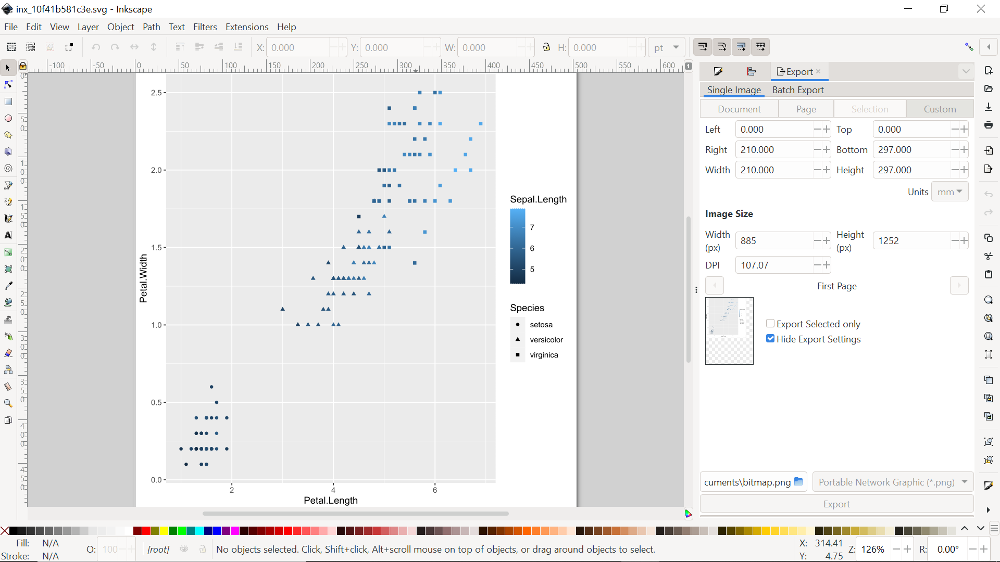

# R wrapper for Inkscape

The [inkscaper](https://github.com/JacekPardyak/inkscaper) package provide a modern and simple toolkit for Scalable Vector Graphics (SVG) processing in R. It wraps the [Inkscape](https://inkscape.org/) which is a Free and open source vector graphics editor for GNU/Linux, Windows and macOS.

## Installing `inkscape`

To install Inkscape on your platform follow the instruction available at: [https://inkscape.org/](https://inkscape.org/) 

On Linux it is:

```
sudo add-apt-repository universe
sudo add-apt-repository ppa:inkscape.dev/stable
sudo apt-get update
sudo apt install inkscape
```

## Installing `inkscaper` R package

The `inkscaper` R package can be installed from GitHub with `devtools`:

```{r}
library(devtools)
install_github("JacekPardyak/inkscaper")
library(inkscaper)
```

## Primary packages

The main purpose of the `inkscaper` package is to bridge the gap (existing today) between R and Inkscape. The trick is to use the `DXF` file format documented here http://images.autodesk.com/adsk/files/autocad_2012_pdf_dxf-reference_enu.pdf for path import/ export in/from R/Inkscape. But real fun starts when `tidyverse` and `sf` are on.

```{r}
library(tidyverse)
library(sf)
```
Inkscape commands are running in the background and you will notice that when you see a pop-up.

## SVG text to SVG path

The original SVG is rendered by the browser as:


With the following code, we convert the text to a path:

```{r}
"man/figures/Den_Haag_text.svg" %>%
  inx_actions(actions = "select-all;export-text-to-path", ext = ".svg") %>%
  inx_write("man/figures/Den_Haag_path.svg")
```
We can now traverse the XML tree of output SVG up to the first "path" node:

```{r}
doc = "man/figures/Den_Haag_path.svg" %>% xml2::read_xml()
paths = xml2::xml_path(xml2::xml_find_all(doc, "//*[name()='path']"))
xml2::xml_find_all(doc, paths[[1]])
```
```
{xml_nodeset (1)}
[1] <path d="M 33.756916,37.590652 V 10.3179 h 9.394775 q 3.181201,0 4.855517,0.390673 2.344043,0. ...
```

## SVG to PNG

The original SVG rendered by the browser as:



can be exported to PNG with Inkscape:

```{r}
img = "https://upload.wikimedia.org/wikipedia/commons/3/30/Den_Haag_wapen.svg" %>%
  inx_actions(actions = NA, ext = ".png") %>%
  png::readPNG(native = TRUE) %>%
  grid::rasterGrob(interpolate=TRUE)
ggplot() +
  annotation_custom(img, xmin=-Inf, xmax=Inf, ymin=-Inf, ymax=Inf)
ggplot2::ggsave("man/figures/Den_Haag_wapen.png")
```


## SVG to Simple Features

The same SVG can be converted to Simple Features supported by the `sf` package:

```{r}
svg_sf <- "https://upload.wikimedia.org/wikipedia/commons/3/30/Den_Haag_wapen.svg" %>%
  inx_svg2sf()
svg_sf
```
```
Simple feature collection with 17930 features and 6 fields
Geometry type: LINESTRING
Dimension:     XY
Bounding box:  xmin: 0.163338 ymin: 0.117232 xmax: 239.0348 ymax: 152.7147
CRS:           NA
First 10 features:
     Layer PaperSpace SubClasses Linetype EntityHandle Text                       geometry
1  Layer 1         NA       <NA>     <NA>         <NA> <NA> LINESTRING (120.204 23.7929...
2  Layer 1         NA       <NA>     <NA>         <NA> <NA> LINESTRING (62.2936 23.5891...
3  Layer 1         NA       <NA>     <NA>         <NA> <NA> LINESTRING (62.07911 16.457...
4  Layer 1         NA       <NA>     <NA>         <NA> <NA> LINESTRING (36.55571 16.559...
5  Layer 1         NA       <NA>     <NA>         <NA> <NA> LINESTRING (36.87745 22.366...
6  Layer 1         NA       <NA>     <NA>         <NA> <NA> LINESTRING (36.9547 23.1356...
7  Layer 1         NA       <NA>     <NA>         <NA> <NA> LINESTRING (36.6928 23.4590...
8  Layer 1         NA       <NA>     <NA>         <NA> <NA> LINESTRING (35.69779 23.589...
9  Layer 1         NA       <NA>     <NA>         <NA> <NA> LINESTRING (12.7476 23.5892...
10 Layer 1         NA       <NA>     <NA>         <NA> <NA> LINESTRING (9.015017 23.486...
```

```{r}
svg_sf %>%
  ggplot() +
  geom_sf()
ggplot2::ggsave("man/figures/Den_Haag_wapen_sf.png")  
```




## Simple Features to SVG

Simple Features geometry can be converted to SVG:

```{r}
"https://geodata.nationaalgeoregister.nl/cbsgebiedsindelingen/wfs?request=GetFeature&service=WFS&version=2.0.0&typeName=cbs_gemeente_2022_gegeneraliseerd&outputFormat=json" %>%
  st_read() %>%
  filter(statnaam == "'s-Gravenhage") %>%
  st_transform(., st_crs("EPSG:4326")) %>% # change CRS to WGS 84
  inx_sf2svg() %>% # export to SVG
  inx_actions(actions = "select-all;transform-scale:1000", ext = ".svg") %>%
  inx_actions(actions = 'export-area-drawing', ext = ".svg") %>%
  inx_write("man/figures/Den_Haag_fill.svg")  
```


and the SVG further modified:

```{r}
"man/figures/Den_Haag_fill.svg" %>%
  inx_style(id = "path18", style = "fill:#FFFFFF;stroke:#000000;stroke-width:1") %>%
  inx_write("man/figures/Den_Haag_stroke.svg")
```



## GIF animation from SVG

From an SVG containing the old city logo that is rendered by the browser as:



we can create an animation of points passing from positive to negative space:

```{r}
library(gganimate)
size = 2000
svg_sf <- "https://upload.wikimedia.org/wikipedia/commons/4/44/Haags_logo.svg" %>%
  inx_svg2sf() %>% st_union() %>% st_polygonize() %>% first()
pos <- svg_sf %>% st_sample(size) %>% st_union() %>%
  st_sfc() %>% st_sf() %>% mutate(states = 1)
neg <- svg_sf %>% st_bbox() %>% st_as_sfc() %>%
  st_difference(svg_sf) %>% st_sample(size) %>%
  st_union() %>% st_sfc() %>% st_sf() %>% mutate(states = 2)
anim <- pos %>%
  bind_rows(neg) %>%
  ggplot() +
  geom_sf() +
  transition_states(states) +
  theme_void()
animate(anim)
anim_save("man/figures/Den_Haag_animated.gif")
```



## RGL surface from SVG 

From the same logo from the SVG file, we can get a surface mesh:

```{r}
library(rgl)
result <- "https://upload.wikimedia.org/wikipedia/commons/4/44/Haags_logo.svg" %>%
  inx_svg2sf() %>% st_union() %>%
  st_polygonize() %>% st_sfc() %>% st_sf()
grid_spacing = .1
grid <- result %>% st_make_grid(what = "centers", cellsize = c(grid_spacing, grid_spacing)) %>%
  st_sf()
heights <- st_join(grid, (result %>% select(geometry) %>% mutate(Z = 5))) %>% replace(is.na(.), 0)
z <- heights %>% st_coordinates() %>% as_tibble() %>%
  bind_cols(heights %>% st_drop_geometry()) %>%
  mutate(X = round(X,1)) %>%
  mutate(Y = round(Y,1)) %>% pivot_wider(names_from = Y, values_from = Z) %>%
  column_to_rownames("X") %>% as.matrix()
x <- 1:nrow(z)
y <- 1:ncol(z)

colors <- c("#FFFFFF", NA, NA, NA, NA, "#00555a") #"#ECB176",
color <- colors[ z - min(z) + 1 ] # assign colors to heights for each point
#color = col
surface3d(x, y, z, color, back = "lines")

htmlwidgets::saveWidget(rglwidget(width = 520, height = 520),
                        file = "man/figures/Den_Haag_surface.html",
                        libdir = "libsR",
                        selfcontained = TRUE)
rgl.viewpoint(-20, -20)
rgl.snapshot("man/figures/Den_Haag_surface.png")
```
This is a snapshot of the resulting interactive plot stored in https://jacekpardyak.github.io/inkscaper/Den_Haag_surface.html (size of the file is 30MB).



## ASCIIfy

You can also create ASCII art from vector or raster images. In fact you can use all Unicode characters.
Here is an example:

```{r}
"https://upload.wikimedia.org/wikipedia/commons/thumb/0/0f/1665_Girl_with_a_Pearl_Earring.jpg/506px-1665_Girl_with_a_Pearl_Earring.jpg" %>%
  magick::image_read() %>% image_ascii(chars = c(".", "S", "#", "&", "@", "\u20AC", "%", "*", "!", ":", ".")) -> txt
df = tibble(label = txt) %>% mutate(x = 0, y = -row_number())
ggplot(df,  aes(x = x, y = y, label = label)) +
  geom_point(alpha = 0) +
  geom_text(size=2, family = "mono") + 
  coord_fixed() +
  theme_void() + 
  xlim(-20, 20)
ggsave("man/figures/Girl_with_a_Pearl_Earring.png")  
txt %>% writeLines("man/figures/Girl_with_a_Pearl_Earring.txt")
```
The output as text:

```
SSS.SSSSSSS.S.........S.........................................SSSS....SSS........................S
SSSSSSSSSSSSSS.SSSSSSSSS.................SSSSSSS..........S....SS..SSSSSSSSS........................
SSSSSSSSSSSSSSSSSSSSSSSSS.S....S..SSSSS.SSSSSSSS...SSSSSSSSSSSSS..SS.S.SSSSSSS..S.SS...SSSSS.S......
SSSSSSSSSSSSSSSSSSSSSSS.SSSS..SSSSSSS.....S...SSSSSSSSSSSSSSSSSSSSSSSSSSSSSSS.SSSSSSSSSSSSSSSSSS....
SSSSSSSSSSSSSSSSSSSSSSSSSSSSSSSSSSSS..............SSSSSSSSSSSSSSSSSSSSSSSSSSSSSSSSSSSSSSSSSSSSSS....
SSSSSSSSSSSSSSSSSSSSSSSSSSSSSSS.SSSSS...........S.....SSSSSSSSSSSSSSSSSSSSSSSSSSSSSSSSSSSSSSSSSS....
SSSSSSSSSSSSSSSSSSSSSSSSSSSSSS..SSS..S....SSSSSSSSS.SSSS.SSS###SSSSSSSSSSSSSSSSSSSSSSSSSSSSSSSSS....
SSSSSSSSSSSSSSSSSSSSSSSSS.SSSSSSSS...SS.SSSSSSSSSSSSSSSS&@€%%%%%%€€@&#SSSSSSSSSSSSSSSSSSSSSSS.SS....
SSSSSSSSSSSSSSSSSSSSSSSSSSSSSSSSSSSSSSSSSSSSSSSSSS..SS&€%%%€@%!!:::!!%@&#SSSSSSSSSSSSSSSSSSSSSSSS..S
SSSSSSSSSSSSSSSSSSSSSSSSSSSSSSSSSSSSSSSSSSSSSSSSS#@€%*!!:!**%%******!*%@&&#SSSSSSSSSSSSSSSSSSSSS....
SSSSSSSSSSSSSSSSSSSSSSSSSSSSSSSSSSSSSSSSSSS#&@@€€%%*%%%%%**!!*%%%%€€%%*€&&###SSSSSSSSSSSSSSSSSSS...S
SSSSSSSSSSSSSSSSSSSSSSSSSSSSSSSSSSSSSSSS&€%******%%%%%%€€@@€%****%%€€€€€%€&&##SSSSSSSSSSSSSSSSSSS.SS
SSSSSSSSSSSSSSSSSSSSSSSSSSSSSSSSSSSSSS@%*********%%%%%%%%%€€@@@€€%*%€@€@&€@&&##SSSSSSSSSSSSSSSSS..SS
SSSSSSSSSSSSSSSSSSSSSSSSSSSSSSSSSSSS#%!!*********%%%%%%%%%%%%€@&&&@€%@@&&@%&&###SSSSSSSSSSSSSS......
SSSSSSSSSSSSSSSSSSSSSSSSSSSSSSSSSS#€*************%%%%%%%%%€€%%€@&&##&@@@&&%@&##SSSSSSSSSSSSSSSSS....
SSSSSSSSSSSSSSSSSSSSSSSSSSSSSSSSSS%*********%**%%%%%%%%%%%%%€€@@&&&&###@&@*%&#&#SS.SSSSSSSSSSSSSS...
SSSSSSSSSSSSSSSSSSSSSSSSSSSSSSSSS€*%%*********%€@€€€%€%%%@@€€€&#&&&&&&&&#@**@#&@SS..S.SSSSSSSSSSS...
SSSSSSSSSSSSSSSSSSSSSSSSSSSSSSSSS@*!!!!!!**%%%€€€€@@@@@€%###&&&####&&&#&#&*%@#&@&#S....SSSSSSSS..S..
SSSSSSSSSSSSSSSSSSSSSSSSSSSSSSSS&!!!!!!!!!!!*%%€@%%&#&&&&&####&&&&##&&&&##%%&##@@#SS...SSS.SSSSSSS..
SSSSSSSSSSSSSSSSSSSSSSSSSSSSSSS#*!!!!!!!!!!!!**%€@@&######&###&&&&&####&##€*@&#@@#S#S.S..S.SSSSSS...
SSSSSSSSSSSSSSSSSSSSSSSSSSSSSSS@*%*!!!!**********%€@&###SS########&&&&&&&S@*@&#&€#SSS.....SS.SSSS...
SSSSSSSSSSSSSSSSSSSSSSSSSSSSSSSS@*@@*!*%%%%%%****%%€&&&########SS####&#&#S&*€@#&%&SSSSSSSSSSSSSSSSS.
SSSSSSSSSSSSSSSSSSSSSSSSSSSSSSS#**&&*:*€€%%!!€&@€€€@&&&##&&######S#######S#*%€#&€€###SSSSSSSSSSSSSSS
SSSSSSSSSSSSSSSSSSSSSSSSSSSSSSS€!***!!%€€%*!!@#&#&@&&&&&###&&############SS%%€&#@€&###..SSSSSSSSSSSS
SSSSSSSSSSSSSSSSSSSSSSSSSSSSSSS%:!!!!*%€€****%€@@%%%€@&&&&&#&###########SSS€%*€#@@&###S..SSSSSSSSS.S
.SSSSSSSSSSSSSSSSSSSSSSSSSSSSSS%!!!!*%€€€*********%%€@&&&&&&###&########SSS€*%%#@€&#&#S...SSSSSSSSSS
SSSSSSSSSSSSSSSSSSSSSSSSSSSSSSS€!!!*%€@@€********%%€@&&&&&&&&&###&&##SSSSSS&*%%#&%&#&#SS..SSSSSSSS..
SSSSSSSSSSSSSSSSSSSSSSSSSSSSSSS&!!*€&&@@&€******%%€@&&&&&&&&&&######SSSSSSS&*%*&#%€##&#SS..SSSSSSS..
SSSSSSSSSSSSSSSSSSSSSSSSSSSSSSSS*!!*€&&@@@*****%%€€@&&&&&&&&&&&&##SSSSSSSSS#*%*&&*!&#@&SSSSSSSS.SSS.
.SSS.SSS.SSSSSSSSSSSSSSSSSSSSSSS&!**!€€%%%%**%%%€€@@&&&&&&&&#&##SSSSSSSSSSS#!!*@&%:€#&@#SSSSSSSSSSSS
.SSSSSSSSSSSSSSSSSSSSSSSSSSSSSSSS€*@@@€@@€€%%%€€€@@@@@@@&&&&####SSSSSSSSSSS#!!*@&€:*##@@#SSSSSSSSSSS
SSSSSSSSSSSSSSSSSSSSSSSSSSSSSSSSSS%*%%€@@@€%%%€€@@@@@@@@@@&&@%&##SSSSSSSSSS#*!!€@@!!@#&€#SSSSSSSSSSS
SSSSSSSSS.SSSSSSSSSSSSSSSSSSSSSSSS#!!*€€@€€%%€€€€@@@€€€@@&&&@%@&#SSSSSSS#SSS***%€&!:%#&@@S#SSSSSSSSS
SSSSSSSSSSSSSSSSSSSSSSSSSSSSSSSSSSS@!!!*%€€€€€€€€€€€€@@&&&&&#&@&&&@@€€€€@&&#€**%*@%:*#&&€&SSSSSSSSSS
SSSSSSSSSSSSSSSSSSSSSSSSSSSSSSSSSSSS#@€%%€€@@@@€@@@@@&&@@@@€%%*!!!!*%€€€@&&#@*%%*€@!!&#&@@SSSSSSSSSS
SSSSSSSSSSSSSSSSSSSSSSSSSSSSSSSSSSSSSSSS###SSSS@*%€€€%*!::...:!*%€@&&&###&&#@*%*%*&*:€#&&€&SSSSSSSS.
SSSSSSSSSSSSSSSSSSSSSSSSSSSSSSSSSSSSSSSSSSSSSSSS@*!!:...:!*€@&&#############&*%*%%@€!*##@@€SSSSSSSS.
SSSSSSSSSSSSSSSSSSSSSSSSSSSSSSSSSSSSSSSSSSSSSS.#%:::::!%€€@&&&&&&############%%**%%@%!&#@€€#SSSSSSSS
SSSSSSSSSSSSSSSSSSSSSSSSSSSSSSSSSSSSSSSSSSSSSS@:.:!*%%%%%€€@&&&#############S@***%*@@*@S&€€€##SSSSSS
SSSSSSSSSSSSSSSSSSSSSSSSSSSSSSSSSSSSSSSSSSSSS%.:*%%%%%%%%€@&&&&#############S@*!!%*%&%€#&@&*€#SSSSSS
SSSSSSSSSSS.SSSSSSSSSSSSSSSSSSSSSSSSSSSSSSSS#:!%€%%%%%%%€@@&&&##############S&*!!**%&%%&&%%!*&#SSSS.
..SSSSSSSSSSSSSSSSSSSSSSSSSSSSSSSSSSSSSSSSSS@%€€%%%%%%%%€€@&&&##############S#*!!*%%@%%@&%!!*@&SSSS.
...SSSS..SSSSSSSSSSSSSSSSSSSSSSSSSSSSSSSSSS@€%%%%%%%%%€€€€€@&###############SS%*****@€*€&€!*!€@#SSSS
..SSSSS..S.SSSSSSSSSSSSSSSSSSS.SSSSSSSSSSS&€€%%€€€€€€%%%%%%%@&&#&#########SSSS€%**!*€@**@&*!!%&#SSSS
..SSSSS...SSSSSSSSSSSSSSSSSSSSSSSSSSSSSSS&€€€€€€€€€%%%%%%%%%@&&&&&&&#######SS#€*%%**€&@@&&€%@&SSSSSS
S..SSS.S....SSSSSSSSSSSSSSSSSSSSSSSSSSSS&€€€€€€€%%%%%%%%%%%€€&&&&&&&&&&&###SS#€%%€%*€&#SSSSSSSSSSSSS
SSSSSSSSSS.SSSSSSSSSSSSSSSSSSSSSSSSSSSSS@€€€€€%%%%%%%%€%%€€€€€&&&&&&&&&#&###S#€€€%%%€##SSSSSSSSSSSSS
SSSSSSSSSSSSSSSSSSSSSSSSSSSSSSSSSSSSSSSS@€€%%%%%%%%%€€€€€€€€€€@&&&#&&&&&&&&&###&#####SSSSSSSSSSSSSSS
SS.SSSSSSSSSSSSSSSSSSSSSSSSSSSSSSSSSSSS#€€%%%%%%%%%€€€€€€€€€€€€@&&&##&#&#&&&&##SS..SSSSSSSSSSSSSSS..
SSSSSSSSSSS.SSSSSSSSS....SSSSSSSSSSSS.#%%€%%%***%%€€€€€€€€€€€€€@&&##&#####&&#&&&#SSSSSSSSSSSS.SSS...
SSSSSSSSSSS.SSSSSSSS.....SSSSSSSSSSS.#%%€€%%%%%%%%€€@@@@€€@@@€€@&####&#&&#&&##&&##SSSSSSSSSSS.SSS...
S.SSSSSSSSSSSSSSSSSS.......SSSSSSSSS#%%€%%%€@@@€€€€@@@@@@@@@@€€@&####&&&&##&&#&&&&#SSSSSSSSSS.SS....
..SSSSSS.SSSSSSSSSSSSSS....SSSSSSSS#%%€€%%%@@@@@€€€€@@@@@@@@€€€@@&###&&&&#&&&####&&#SSSSSSSSSSSSSS..
S.SSSSSSSSSSSSSSSSSSSSSSSSSSSSSSSS#%%€%%%%%@@@@@€€€€@@@@@@@€€€€@&&######&#&&&&###&&#SSSSSSSSSSSSSSS.
S....S.....SSSSSSSSSSSSSSS...SSSS#€%€€%%%%%€@&@€€€€€@@@@@@@€€€€@&&&######&&&&&&#####SSSSSSSSS..S.SS.
............S.SSSSSSSSSSSS...SSS#%€€%%%%%%€@@&@€€€€€@@@@@@@€€€€@&&&##########&#######SSSSSSSS..S...S
.........SS....SS............SSS€€€€%%%%%€€€@&&@€€€@@@@@@@@€€€@@@&&##################SSSSS.SS......S
SS............S.S.........SSSSS€%€€%%%%%€€€€@@&&@€€@@@@@&&@@€€@@&&####################SSSSSSS...SSS.
SS..SS.SS...SSSSSS...........S@€€€€%%%€€€€€@@&&&&@@@@@@@&&@@@@@&&&#########SSSSS#####SSSSSSSSSSSSSSS

```

The output as annotated ggplot:


## R to Inkscape

It's possible to send `ggplot` from `R` directly to `Inkscape` window with command `inx_plot()`. For example:

```{r}
{ggplot(iris,
        aes(x = Petal.Length,
            y = Petal.Width,
            colour = Sepal.Length,
            shape = Species)) +
    geom_point()} %>%
  inx_plot()
```



## Closing

This is the first version of the package. If you have a comment, request or bug report, don't hesitate.

The popup is something normal and needed by Inkscape, and it can hang at times (just kill the child process and continue).

On non-GUI systems some Inkscape actions will not work, period.

I'm testing on Windows 10 and Ubuntu 22.04 Inkscape 1.2.1.

Work on vignettes is still ongoing, but they are already available in the `vignettes`.

